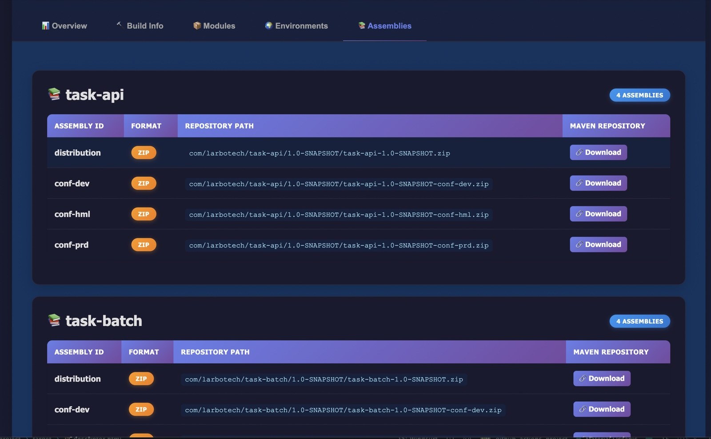
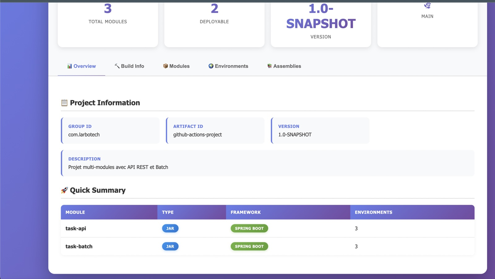

# Maven Deploy Manifest Plugin

[](https://central.sonatype.com/artifact/io.github.tourem/deploy-manifest-plugin)
[](https://opensource.org/licenses/Apache-2.0)
[](https://openjdk.org/)

> **Know exactly what's running in production—automatically.**


> 📚 Documentation:
> - English: [Full Documentation](./doc-en.md)
> - Français: [Documentation complète](./doc.md)


## Table of Contents
- [Why This Plugin?](#why-this-plugin)
- [What You Get in 30 Seconds](#what-you-get-in-30-seconds)
- [Key Features That Save You Time](#key-features-that-save-you-time)
- [Perfect For](#perfect-for)
- [Try It Now (No Installation Required)](#try-it-now-no-installation-required)
- [See It In Action](#see-it-in-action)
- [Real-World Example](#real-world-example)
- [What Makes It Different?](#what-makes-it-different)
- [Who's Using It?](#whos-using-it)
- [Quick Start](#quick-start)
- [Usage (quick)](#usage-quick)
- [Example JSON output](#example-json-output)
- [Configuration Parameters](#configuration-parameters)
- [Requirements](#requirements)
- [Building from Source](#building-from-source)
- [What Gets Detected (high level)](#what-gets-detected-high-level)
- [Troubleshooting](#troubleshooting)
- [License](#license)

## Why This Plugin?

Ever deployed to production and wondered:
- Which exact dependencies are in this JAR?
- What Docker image was deployed and from which commit?
- Which Spring Boot profiles are active in each environment?

**Stop guessing. Start knowing.**

This plugin generates a comprehensive deployment descriptor with commit SHA, container images, dependencies, and environment configs in a single JSON/YAML/HTML file.

**Published on Maven Central:** `io.github.tourem:deploy-manifest-plugin`

---

## What You Get in 30 Seconds

```bash
# One command, complete traceability
mvn io.github.tourem:deploy-manifest-plugin:2.3.0:generate
```

Generates `descriptor.json` with project/build/git metadata and module insights.
See "Example JSON output" below for a concise sample.

---

## Key Features That Save You Time

| Feature | What It Does | Why You Care |
|---|---|---|
| Auto-detection | Scans modules, frameworks, env configs | Zero manual setup |
| Full traceability | Git commit/branch, CI metadata | Debug prod issues fast |
| Docker aware | Detects Jib, Spring Boot build-image, Fabric8, Quarkus, Micronaut, JKube | Know what's containerized |
| Dependency tree (opt) | Flat/Tree, collapsible tree with highlight + Prev/Next, quick filters, CSV, duplicates, scope badges | Understand your runtime |
| Multiple formats | JSON, YAML, HTML report | Share with all stakeholders |

## Perfect For

- DevOps teams: know what's deployed without SSH
- Security audits: track every dependency and version
- Incident response: identify what changed between releases
- Compliance: generate deployment docs automatically
- Multi-module projects: see the full picture

## Try It Now (No Installation Required)

```bash
# Single module or multi-module (run at root)
mvn io.github.tourem:deploy-manifest-plugin:2.3.0:generate

# With HTML report
mvn io.github.tourem:deploy-manifest-plugin:2.3.0:generate -Ddescriptor.generateHtml=true
```

---

## See It In Action

- JSON: see the "Example JSON output" section below
- HTML report includes: interactive dashboard, Dependencies tab per module with collapsible tree (highlight + Prev/Next, quick filters, scope badges), environment configs, CSV export
- Screenshots:
  - 
  - 

---

## Real-World Example

Before deployment:
```bash
mvn clean package
mvn io.github.tourem:deploy-manifest-plugin:2.3.0:generate
cat target/descriptor.json  # verify
mvn deploy
```

In production (incident happens):
```bash
# Download descriptor from your artifact repository
curl https://repo.example.com/.../descriptor.json

# Instantly see:
# - Git commit SHA → check exact code
# - Docker image tag → verify container
# - Spring profiles → confirm configuration
# - Dependencies → spot version conflicts
```

---

## What Makes It Different?

| Other Tools | Maven Deploy Manifest Plugin |
|-------------|-----------------------------|
| Manual configuration required | Zero-config auto-detection |
| Only captures basic info | Complete deployment picture |
| Separate tools for Docker, Git, Spring Boot | All-in-one solution |
| Complex setup | One command, done |
| Static output | JSON/YAML/HTML + webhooks |

---

## Who's Using It?

> "We reduced our production incident response time by 70%. Now we know exactly what's deployed without digging through CI logs."
> — DevOps Team, Fortune 500 Company

> "Security audits used to take days. Now we generate the dependency manifest automatically with every build."
> — Security Engineer, FinTech Startup

---


## Quick Start

### Installation

Add the plugin to your project's `pom.xml`:

```xml
<build>
    <plugins>
        <plugin>
            <groupId>io.github.tourem</groupId>
            <artifactId>deploy-manifest-plugin</artifactId>
            <version>2.3.0</version>
        </plugin>
    </plugins>
</build>
```

Or use it directly without adding to POM:

```bash
mvn io.github.tourem:deploy-manifest-plugin:2.3.0:generate
```

### Basic Usage

Generate a deployment descriptor at your project root:

```bash
mvn io.github.tourem:deploy-manifest-plugin:2.3.0:generate
```

This creates a `descriptor.json` file containing all deployment information.

## Usage (quick)

The most common commands at a glance:

```bash
# Default (descriptor.json at project root)
mvn io.github.tourem:deploy-manifest-plugin:2.3.0:generate

# YAML or both JSON+YAML
mvn io.github.tourem:deploy-manifest-plugin:2.3.0:generate -Ddescriptor.exportFormat=yaml
mvn io.github.tourem:deploy-manifest-plugin:2.3.0:generate -Ddescriptor.exportFormat=both

# Generate an HTML page for non-technical stakeholders
mvn io.github.tourem:deploy-manifest-plugin:2.3.0:generate -Ddescriptor.generateHtml=true

# Attach a ZIP artifact for repository deployment
mvn io.github.tourem:deploy-manifest-plugin:2.3.0:generate -Ddescriptor.format=zip -Ddescriptor.attach=true

# Dry-run (print summary, no files)
mvn io.github.tourem:deploy-manifest-plugin:2.3.0:generate -Ddescriptor.summary=true
```

### Options cheat sheet

- `-Ddescriptor.summary=true` — Dry-run (prints dashboard, no files)
- `-Ddescriptor.generateHtml=true` — Generate the HTML report
- `-Ddescriptor.exportFormat=yaml|both` — Export YAML or both JSON+YAML
- `-Ddescriptor.outputFile=deployment-info.json` — Override output filename
- `-Ddescriptor.attach=true [-Ddescriptor.format=zip]` — Attach artifact for repository deployment
- `-Ddescriptor.includeDependencyTree=true [-Ddescriptor.dependencyTreeFormat=both]` — Include dependencies (Flat+Tree)

### POM Configuration

Configure the plugin to run automatically during the build:

```xml
<build>
    <plugins>
        <plugin>
            <groupId>io.github.tourem</groupId>
            <artifactId>deploy-manifest-plugin</artifactId>
            <version>2.3.0</version>
            <configuration>
                <!-- Output file name (default: descriptor.json) -->
                <outputFile>deployment-info.json</outputFile>

                <!-- Output directory (default: project root) -->
                <outputDirectory>target</outputDirectory>


                <!-- Pretty print JSON (default: true) -->
                <prettyPrint>true</prettyPrint>

                <!-- Skip execution (default: false) -->
                <skip>false</skip>

                <!-- Archive format: zip, tar.gz, tar.bz2, jar (default: none) -->
                <format>zip</format>

                <!-- Classifier for the artifact (default: descriptor) -->
                <classifier>descriptor</classifier>

                <!-- Attach artifact to project for deployment (default: false) -->
                <attach>true</attach>
            </configuration>
            <executions>
                <execution>
                    <id>generate-descriptor</id>
                    <phase>package</phase>
                    <goals>
                        <goal>generate</goal>
                    </goals>
                </execution>
            </executions>
        </plugin>
    </plugins>
</build>
```

## Example JSON output

Below is a concise example of the descriptor. Fields may be omitted when not applicable.

```json
{
  "projectGroupId": "com.example",
  "projectArtifactId": "demo",
  "projectVersion": "1.0.0",
  "deployableModules": [
    {
      "groupId": "com.example",
      "artifactId": "demo",
      "version": "1.0.0",
      "packaging": "jar",
      "springBootExecutable": true,
      "container": {
        "tool": "jib",
        "image": "ghcr.io/acme/demo",
        "tag": "1.0.0"
      },
      "dependencies": {
        "summary": {
          "total": 2,
          "direct": 2,
          "transitive": 0,
          "scopes": { "compile": 1, "runtime": 1 },
          "optional": 0
        },
        "flat": [
          {
            "groupId": "g",
            "artifactId": "a",
            "version": "1.0",
            "scope": "compile",
            "type": "jar",
            "optional": false,
            "depth": 1,
            "path": "g:a:jar:1.0"
          },
          {
            "groupId": "g",
            "artifactId": "r",
            "version": "2.0",
            "scope": "runtime",
            "type": "jar",
            "optional": false,
            "depth": 1,
            "path": "g:r:jar:2.0"
          }
        ]
      }
    }
  ],
  "totalModules": 1,
  "deployableModulesCount": 1
}
```


## Configuration Parameters

All plugin options are listed below.


### Core Parameters

| Parameter | System Property | Default | Description |
|-----------|----------------|---------|-------------|
| `outputFile` | `descriptor.outputFile` | `descriptor.json` | Name of the output JSON file |
| `outputDirectory` | `descriptor.outputDirectory` | `${project.build.directory}` (target/) | Output directory (absolute or relative path) |
| `prettyPrint` | `descriptor.prettyPrint` | `true` | Format JSON with indentation |
| `skip` | `descriptor.skip` | `false` | Skip plugin execution |
| `format` | `descriptor.format` | none | Archive format: `zip`, `tar.gz`, `tar.bz2`, `jar` |
| `classifier` | `descriptor.classifier` | `descriptor` | Classifier for the attached artifact |
| `attach` | `descriptor.attach` | `false` | Attach artifact to project for deployment |

### Advanced Features Parameters

| Parameter | System Property | Default | Description |
|-----------|----------------|---------|-------------|
| `summary` | `descriptor.summary` | `false` | **Dry-run mode**: Print dashboard to console without generating files |
| `generateHtml` | `descriptor.generateHtml` | `false` | **HTML generation**: Generate readable HTML documentation |
| `postGenerationHook` | `descriptor.postGenerationHook` | none | **Post-hook**: Execute local script/command after generation |

### Bonus Features Parameters

| Parameter | System Property | Default | Description |
|-----------|----------------|---------|-------------|
| `exportFormat` | `descriptor.exportFormat` | `json` | Export format: `json`, `yaml`, `both` |
| `validate` | `descriptor.validate` | `false` | Validate descriptor structure |
| `sign` | `descriptor.sign` | `false` | Generate SHA-256 digital signature |
| `compress` | `descriptor.compress` | `false` | Compress JSON with GZIP |
| `webhookUrl` | `descriptor.webhookUrl` | none | HTTP endpoint to notify after generation |
| `webhookToken` | `descriptor.webhookToken` | none | Bearer token for webhook authentication |
| `webhookTimeout` | `descriptor.webhookTimeout` | `10` | Webhook timeout in seconds |


### Dependency Tree Parameters

| Parameter | System Property | Default | Description |
|-----------|-----------------|---------|-------------|
| `includeDependencyTree` | `descriptor.includeDependencyTree` | `false` | Enable dependency tree collection |
| `dependencyTreeDepth` | `descriptor.dependencyTreeDepth` | `-1` | Depth: `-1`=unlimited, `0`=direct-only |
| `dependencyScopes` | `descriptor.dependencyScopes` | `compile,runtime` | Comma-separated scopes to include |
| `dependencyTreeFormat` | `descriptor.dependencyTreeFormat` | `flat` | Output format: `flat`, `tree`, `both` |
| `excludeTransitive` | `descriptor.excludeTransitive` | `false` | Exclude transitive dependencies entirely |
| `includeOptional` | `descriptor.includeOptional` | `false` | Include optional dependencies |


### Licenses Parameters

| Parameter | System Property | Default | Description |
|-----------|-----------------|---------|-------------|
| `includeLicenses` | `descriptor.includeLicenses` | `false` | Enable license collection for all dependencies (via POM parsing) |
| `licenseWarnings` | `descriptor.licenseWarnings` | `false` | Show warnings/badges for incompatible/unknown licenses in HTML |
| `incompatibleLicenses` | `descriptor.incompatibleLicenses` | `GPL-3.0,AGPL-3.0,SSPL` | Comma-separated list considered incompatible (case-insensitive) |
| `includeTransitiveLicenses` | `descriptor.includeTransitiveLicenses` | `true` | Include licenses for transitive dependencies |

Example (CLI):
```
mvn io.github.tourem:deploy-manifest-plugin:2.3.0:generate -Ddescriptor.includeLicenses=true -Ddescriptor.licenseWarnings=true
```

### Build Properties Parameters

| Parameter | System Property | Default | Description |
|-----------|-----------------|---------|-------------|
| `includeProperties` | `descriptor.includeProperties` | `false` | Include Maven/project/custom/system/env properties (grouped) |
| `includeSystemProperties` | `descriptor.includeSystemProperties` | `true` | Include Java system properties |
| `includeEnvironmentVariables` | `descriptor.includeEnvironmentVariables` | `false` | Include environment variables (use with care) |
| `filterSensitiveProperties` | `descriptor.filterSensitiveProperties` | `true` | Filter by sensitive key patterns (password, token, apikey, auth, etc.) |
| `maskSensitiveValues` | `descriptor.maskSensitiveValues` | `true` | Mask sensitive values instead of dropping them |
| `propertyExclusions` | `descriptor.propertyExclusions` | `password,secret,token,apikey,api-key,api_key,credentials,auth,key` | Extra sensitive key patterns (comma-separated) |

Example (CLI):
```
mvn io.github.tourem:deploy-manifest-plugin:2.3.0:generate -Ddescriptor.includeProperties=true -Ddescriptor.includeEnvironmentVariables=true
```

### Plugins Parameters

| Parameter | System Property | Default | Description |
|-----------|-----------------|---------|-------------|
| `includePlugins` | `descriptor.includePlugins` | `false` | Include effective build plugins summary and table |
| `includePluginConfiguration` | `descriptor.includePluginConfiguration` | `true` | Include sanitized plugin configuration blocks |
| `includePluginManagement` | `descriptor.includePluginManagement` | `true` | Include pluginManagement entries (+ Used-in-build indicator) |
| `checkPluginUpdates` | `descriptor.checkPluginUpdates` | `false` | Check Maven Central for newer plugin versions (best-effort) |
| `filterSensitivePluginConfig` | `descriptor.filterSensitivePluginConfig` | `true` | Mask sensitive values in plugin configs |
| `pluginUpdateTimeoutMillis` | `descriptor.pluginUpdateTimeoutMillis` | `2000` | Timeout for update checks (ms) |

Example (CLI):
```
mvn io.github.tourem:deploy-manifest-plugin:2.3.0:generate -Ddescriptor.includePlugins=true -Ddescriptor.checkPluginUpdates=true -Ddescriptor.generateHtml=true
```


#### Build Metadata

The descriptor includes minimal build metadata (commit SHA, branch, CI info) for traceability. Use `jq` to extract fields from `descriptor.json` if needed.


### Framework Extensibility (SPI)

- Built-in detector: Spring Boot
- Extend by implementing `FrameworkDetector` and registering it via ServiceLoader in `META-INF/services/io.github.tourem.maven.descriptor.spi.FrameworkDetector`.
- See the source packages `io.github.tourem.maven.descriptor.spi` and `...framework` for examples.


### Dependency Tree (optional)

Disabled by default for backward compatibility. When enabled, dependencies are collected per deployable/executable module and exposed in JSON/YAML, plus an interactive section in the HTML report.

- Quick enable (CLI):
```
mvn io.github.tourem:deploy-manifest-plugin:2.3.0:generate -Ddescriptor.includeDependencyTree=true
```
- Common options: `dependencyTreeDepth` (-1=unlimited, 0=direct), `dependencyScopes` (default: compile,runtime), `dependencyTreeFormat` (flat|tree|both), `includeOptional` (default: false)

<details>
<summary>More examples (CLI + POM)</summary>

```
mvn ... -Ddescriptor.includeDependencyTree=true -Ddescriptor.dependencyTreeDepth=1
mvn ... -Ddescriptor.includeDependencyTree=true -Ddescriptor.dependencyScopes=compile,runtime
mvn ... -Ddescriptor.includeDependencyTree=true -Ddescriptor.dependencyTreeFormat=both
mvn ... -Ddescriptor.includeDependencyTree=true -Ddescriptor.excludeTransitive=false -Ddescriptor.includeOptional=false
```

POM configuration:
```xml
<plugin>
  <groupId>io.github.tourem</groupId>
  <artifactId>deploy-manifest-plugin</artifactId>
  <version>2.3.0</version>
  <configuration>
    <includeDependencyTree>true</includeDependencyTree>
    <dependencyTreeDepth>-1</dependencyTreeDepth>
    <dependencyScopes>compile,runtime</dependencyScopes>
    <dependencyTreeFormat>flat</dependencyTreeFormat>
    <excludeTransitive>false</excludeTransitive>
    <includeOptional>false</includeOptional>
  </configuration>
</plugin>
```

Notes:
- Full transitive dependency resolution is supported; hierarchical filtering keeps ancestors of matches visible.
- With `-Ddescriptor.generateHtml=true`, the HTML adds an interactive Dependencies tab per module (Flat/Tree views, collapsible tree with highlight + Prev/Next, quick filters, scope badges).
</details>


## Requirements

- **Java**: 17 or higher
- **Maven**: 3.6.0 or higher

## Building from Source

```bash
mvn clean install
# optional
mvn test
```

## What Gets Detected (high level)

- Modules and packaging, executable detection (Spring Boot), main class and Java version
- Environment and actuator settings, assembly artifacts, container images
- Optional dependency tree per executable module (summary + flat/tree details)

See "Example JSON output" below for structure.


## Troubleshooting

### Plugin not found
Make sure the plugin is installed in your local Maven repository:
```bash
mvn clean install
```

### Multi-module projects
Run the plugin from the parent POM directory. It will analyze all modules in the reactor.

## License

This project is licensed under the Apache License 2.0.

---

**Made with ❤️ by LarboTech**

