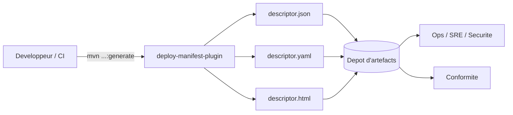

# Maven Deploy Manifest Plugin — Guide complet

> Ne livrez plus des boîtes noires. Générez une source unique de vérité sur ce que vous construisez, packagez et déployez — automatiquement.

Ce guide explique comment installer, exécuter et tirer le meilleur parti de `io.github.tourem:deploy-manifest-plugin`. Vous découvrirez ses fonctionnalités, toutes les options de configuration et des recettes prêtes à copier pour les sorties JSON/YAML/HTML, avec captures d’écran et schémas.

---
## Sommaire
- [Pourquoi utiliser ce plugin ?](#pourquoi-utiliser-ce-plugin-)
- [Démarrage rapide](#demarrage-rapide)
- [Comment ça marche (architecture)](#comment-ca-marche-architecture)
- [Aperçu du rapport HTML](#apercu-du-rapport-html)
- [Parcours des fonctionnalités](#parcours-des-fonctionnalites)
  - [1) Build Info (toujours actif)](#1-build-info-toujours-actif)
  - [2) Modules + détection exécutable](#2-modules--detection-executable)
  - [3) Arbre des dépendances (optionnel)](#3-arbre-des-dependances-optionnel)
  - [4) Licences et conformité (optionnel)](#4-licences-et-conformite-optionnel)
  - [5) Propriétés (optionnel)](#5-proprietes-optionnel)
  - [6) Plugins (optionnel)](#6-plugins-optionnel)
- [Recettes à copier-coller](#recettes-a-copier-coller)
- [Référence de configuration](#reference-de-configuration)
- [Exemples CI/CD](#exemples-cicd)
- [Dépannage](#depannage) · [FAQ](#faq) · [Support](#support)


## Pourquoi utiliser ce plugin ?
- Une seule commande produit des métadonnées de déploiement complètes (Git, CI/CD, modules, conteneurs, dépendances, propriétés, plugins, profils)
- Sorties pour machines et humains : JSON/YAML pour l’automatisation + un rapport HTML agréable à lire
- Traçabilité et conformité : licences, propriétés, plugins et arbre de dépendances (à la demande)

---

## Demarrage rapide

Exécution sans modifier le POM :

```bash
mvn io.github.tourem:deploy-manifest-plugin:2.3.1:generate -Ddescriptor.generateHtml=true
```

Ajout dans le POM pour des builds reproductibles :

```xml
<build>
  <plugins>
    <plugin>
      <groupId>io.github.tourem</groupId>
      <artifactId>deploy-manifest-plugin</artifactId>
      <version>2.3.1</version>
      <executions>
        <execution>
          <id>generate-deploy-manifest</id>
          <phase>package</phase>
          <goals><goal>generate</goal></goals>
        </execution>
      </executions>
    </plugin>
  </plugins>
</build>
```

Les fichiers sont écrits à la racine du projet (ou dans `target/` selon configuration) : `descriptor.json` et, en option, `descriptor.yaml` / `descriptor.html` / archive.

---

## Comment ça marche (architecture)



---

## Aperçu du rapport HTML

- Tableau de bord d’ensemble : résumé du projet, totaux, badges rapides
- Onglet Build Info : Git, CI/CD, runtime Maven, goals, propriétés (avec recherche), profils, et Build Plugins
- Onglet Modules : métadonnées par module déployable (packaging, version de Java, main class)
- Onglet Dépendances (optionnel) : vues Flat/Tree, surlignage avec Préc./Suiv., filtres rapides, badges de portée
- Onglets Environnements & Assemblies : lorsqu’ils existent dans le projet

Captures d’ecran :


---

## Parcours des fonctionnalités

### 1) Build Info (toujours actif)
- Git : SHA (court/long), branche, tag, état dirty, URL remote, message, auteur, date
- CI/CD : fournisseur, identifiant/URL du build (auto‑détection GitHub Actions, GitLab CI, Jenkins, etc.)
- Maven : version et home du runtime ; goals exécutés et goal par défaut
- Propriétés : groupes Project / Maven / Custom / System / Environment avec masquage et champ de recherche
- Profils : default, actifs, disponibles
- Build Plugins (optionnel) : voir section « Plugins »

### 2) Modules + détection exécutable
- Liste de tous les modules ; modules déployables mis en évidence (JAR/WAR et Spring Boot)
- Version Java, finalName, main class quand détectés
- Images de conteneur : détection Jib, Spring Boot build‑image, Fabric8, Quarkus, Micronaut, JKube

### 3) Arbre des dépendances (optionnel)
- Résumé + vues Flat ou Tree ; export CSV depuis l’HTML ; détection de doublons
- Recherche hiérarchique, surlignage et navigation ; filtres rapides par familles connues

### 4) Licences et conformité (optionnel)
- Analyse des licences POM pour dépendances directes et transitives
- Ensemble de licences incompatibles configurable (par défaut : GPL‑3.0, AGPL‑3.0, SSPL)
- Vue Conformité (HTML) avec camembert et badges d’alerte

### 5) Propriétés (optionnel)
- Contexte de build complet : project, maven, custom, system, environment
- Filtrage et masquage des clés sensibles (password, secret, token, apikey, credentials, auth, key)

### 6) Plugins (optionnel)
- Liste des plugins effectifs : coordonnées, version (badge « outdated → latest » si activé), phase, goals, source (pom/profile/parent ; hérité)
- Extraits de configuration assainis (masquage des clés sensibles)
- Tableau Plugin Management : plugins gérés avec version et indicateur « Used in Build »
- Vérification optionnelle des mises à jour (Maven Central, best‑effort, timeout configurable)

---

## Recettes a copier-coller

JSON minimal :
```bash
mvn io.github.tourem:deploy-manifest-plugin:2.3.1:generate
```

JSON + YAML + HTML :
```bash
mvn io.github.tourem:deploy-manifest-plugin:2.3.1:generate -Ddescriptor.exportFormat=both -Ddescriptor.generateHtml=true
```

Arbre des dependances (Tree+Flat) avec scopes compile+runtime :
```bash
mvn io.github.tourem:deploy-manifest-plugin:2.3.1:generate -Ddescriptor.includeDependencyTree=true -Ddescriptor.dependencyTreeFormat=both -Ddescriptor.dependencyScopes=compile,runtime
```

Licences avec avertissements et liste incompatible personnalisee :
```bash
mvn io.github.tourem:deploy-manifest-plugin:2.3.1:generate -Ddescriptor.licenseWarnings=true -Ddescriptor.incompatibleLicenses=GPL-3.0,AGPL-3.0,SSPL
```

Proprietes incluant les variables d’environnement :
```bash
mvn io.github.tourem:deploy-manifest-plugin:2.3.1:generate -Ddescriptor.includeProperties=true -Ddescriptor.includeEnvironmentVariables=true
```

Plugins avec configuration et verification des mises a jour :
```bash
mvn io.github.tourem:deploy-manifest-plugin:2.3.1:generate -Ddescriptor.includePlugins=true -Ddescriptor.includePluginConfiguration=true -Ddescriptor.checkPluginUpdates=true -Ddescriptor.generateHtml=true
```

Tout combiner :
```bash
mvn io.github.tourem:deploy-manifest-plugin:2.3.1:generate \
  -Ddescriptor.exportFormat=both -Ddescriptor.generateHtml=true \
  -Ddescriptor.includeDependencyTree=true -Ddescriptor.dependencyTreeFormat=both \
  -Ddescriptor.includeLicenses=true -Ddescriptor.licenseWarnings=true \
  -Ddescriptor.includeProperties=true -Ddescriptor.includeEnvironmentVariables=true \
  -Ddescriptor.includePlugins=true -Ddescriptor.checkPluginUpdates=true
```

Configuration POM (extrait courant) :
```xml
<plugin>
  <groupId>io.github.tourem</groupId>
  <artifactId>deploy-manifest-plugin</artifactId>
  <version>2.3.1</version>
  <configuration>
    <exportFormat>both</exportFormat>
    <generateHtml>true</generateHtml>
    <includeDependencyTree>true</includeDependencyTree>
    <dependencyTreeFormat>both</dependencyTreeFormat>
    <includeLicenses>true</includeLicenses>
    <licenseWarnings>true</licenseWarnings>
    <includeProperties>true</includeProperties>
    <includeEnvironmentVariables>false</includeEnvironmentVariables>
    <includePlugins>true</includePlugins>
    <checkPluginUpdates>false</checkPluginUpdates>
  </configuration>
  <executions>
    <execution>
      <id>generate-deploy-manifest</id>
      <phase>package</phase>
      <goals><goal>generate</goal></goals>
    </execution>
  </executions>
</plugin>
```

---

## Référence de configuration

Paramètres de base :

| Paramètre | Propriété système | Défaut | Description |
|---|---|---|---|
| outputFile | descriptor.outputFile | descriptor.json | Nom du fichier JSON de sortie |
| outputDirectory | descriptor.outputDirectory | ${project.build.directory} | Répertoire de sortie |
| prettyPrint | descriptor.prettyPrint | true | Indentation du JSON |
| skip | descriptor.skip | false | Ne pas exécuter le plugin |
| format | descriptor.format | none | Archive : zip, tar.gz, tar.bz2, jar |
| classifier | descriptor.classifier | descriptor | Classifier attaché |
| attach | descriptor.attach | false | Attacher l'archive au projet |
| exportFormat | descriptor.exportFormat | json | Formats à écrire : json, yaml, both |
| validate | descriptor.validate | false | Valider le descripteur |
| sign | descriptor.sign | false | Générer une signature SHA-256 |
| compress | descriptor.compress | false | Écrire aussi .json.gz |
| webhookUrl | descriptor.webhookUrl | — | Envoyer le descripteur en POST en cas de succès |
| webhookToken | descriptor.webhookToken | — | En-tête Bearer token |
| webhookTimeout | descriptor.webhookTimeout | 10 | Délai (secondes) |
| summary | descriptor.summary | false | Tableau de bord console (simulation) |
| generateHtml | descriptor.generateHtml | false | Générer le rapport HTML |
| postGenerationHook | descriptor.postGenerationHook | — | Exécuter une commande/script local |

Arbre des dépendances :

| Paramètre | Propriété système | Défaut | Description |
|---|---|---|---|
| includeDependencyTree | descriptor.includeDependencyTree | false | Activer l'arbre de dépendances |
| dependencyTreeDepth | descriptor.dependencyTreeDepth | -1 | -1=illimité, 0=direct |
| dependencyScopes | descriptor.dependencyScopes | compile,runtime | Scopes à inclure |
| dependencyTreeFormat | descriptor.dependencyTreeFormat | flat | flat, tree, both |
| excludeTransitive | descriptor.excludeTransitive | false | Retirer complètement les transitives |
| includeOptional | descriptor.includeOptional | false | Inclure les dépendances optionnelles |

Licences :

| Paramètre | Propriété système | Défaut |
|---|---|---|
| includeLicenses | descriptor.includeLicenses | false |
| licenseWarnings | descriptor.licenseWarnings | false |
| incompatibleLicenses | descriptor.incompatibleLicenses | GPL-3.0,AGPL-3.0,SSPL |
| includeTransitiveLicenses | descriptor.includeTransitiveLicenses | true |

Propriétés de build :

| Paramètre | Propriété système | Défaut |
|---|---|---|
| includeProperties | descriptor.includeProperties | false |
| includeSystemProperties | descriptor.includeSystemProperties | true |
| includeEnvironmentVariables | descriptor.includeEnvironmentVariables | false |
| filterSensitiveProperties | descriptor.filterSensitiveProperties | true |
| maskSensitiveValues | descriptor.maskSensitiveValues | true |
| propertyExclusions | descriptor.propertyExclusions | password,secret,token,apikey,api-key,api_key,credentials,auth,key |

Plugins :

| Paramètre | Propriété système | Défaut |
|---|---|---|
| includePlugins | descriptor.includePlugins | false |
| includePluginConfiguration | descriptor.includePluginConfiguration | true |
| includePluginManagement | descriptor.includePluginManagement | true |
| checkPluginUpdates | descriptor.checkPluginUpdates | false |
| filterSensitivePluginConfig | descriptor.filterSensitivePluginConfig | true |
| pluginUpdateTimeoutMillis | descriptor.pluginUpdateTimeoutMillis | 2000 |

---

## Exemples CI/CD

GitHub Actions (extrait) :
```yaml
- name: Generate Deploy Manifest
  run: mvn -B io.github.tourem:deploy-manifest-plugin:2.3.1:generate -Ddescriptor.exportFormat=both -Ddescriptor.generateHtml=true
- name: Upload artifacts
  uses: actions/upload-artifact@v4
  with:
    name: deploy-manifest
    path: |
      descriptor.json
      descriptor.yaml
      descriptor.html
```

---

## Dépannage
- Plugin introuvable : lancez `mvn clean install` en local ou vérifiez la publication sur Maven Central
- Onglet Dependencies vide : activez `-Ddescriptor.includeDependencyTree=true`
- Variables d'environnement manquantes : ajoutez `-Ddescriptor.includeEnvironmentVariables=true` et vérifiez le masquage
- Vérifications de mises à jour lentes : ajustez `-Ddescriptor.pluginUpdateTimeoutMillis`

---

## FAQ
- Des données sensibles sont-elles stockées ? Par défaut, les clés sensibles sont filtrées et masquées (propriétés, configs de plugins). Vérifiez le masquage avant partage.
- Est-ce adapté au CI ? Oui. Le plugin est en lecture seule et écrit des fichiers/artefacts ; les appels réseau sont optionnels (webhook, vérifications de versions).

---

## Support
Ouvrez un ticket ou une PR sur le dépôt. Les contributions sont les bienvenues !

